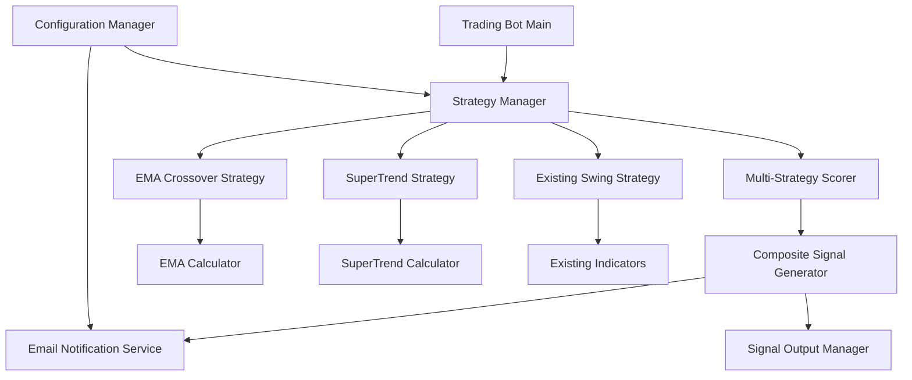

# Design Document

## Overview

This design document outlines the implementation of advanced trading strategies for the existing stock trading bot: EMA crossover detection, SuperTrend indicator, and a multi-strategy scoring system. The solution will integrate seamlessly with the existing modular architecture while adding email notification capabilities for high-confidence signals.

The design follows the established patterns in the codebase, extending the `StrategyInterface` and leveraging the existing indicator calculation framework. The multi-strategy scoring system will provide weighted composite signals that combine multiple strategies for more reliable trading recommendations.

## Architecture

### High-Level Architecture



### Component Integration

The new components will integrate with the existing architecture:

- **Strategy Layer**: New strategy classes implementing `StrategyInterface`
- **Indicator Layer**: New indicator calculators following existing patterns
- **Signal Processing**: Enhanced signal generation with composite scoring
- **Notification Layer**: New email service for alert delivery
- **Configuration**: Extended YAML configuration for new strategies and email settings

## Components and Interfaces

### 1. EMA Crossover Strategy

**Class**: `EMACrossoverStrategy`
**Interface**: Implements `StrategyInterface`

```python
class EMACrossoverStrategy(StrategyInterface):
    def __init__(self, short_period: int = 50, long_period: int = 200, 
                 approach_threshold: float = 0.02):
        """
        Initialize EMA crossover strategy.
        
        Args:
            short_period: Short EMA period (default 50)
            long_period: Long EMA period (default 200)
            approach_threshold: Threshold for "approaching" signals (default 2%)
        """
    
    def generate_signal(self, data: pd.DataFrame, indicators: Dict) -> Signal:
        """Generate EMA crossover signals."""
    
    def detect_crossover(self, short_ema: pd.Series, long_ema: pd.Series) -> str:
        """Detect crossover type: 'bullish', 'bearish', 'approaching', 'none'"""
    
    def calculate_crossover_strength(self, short_ema: float, long_ema: float, 
                                   price: float) -> float:
        """Calculate signal strength based on EMA relationship and price action."""
```

**Key Features**:
- Configurable EMA periods (default 50/200)
- Crossover detection (bullish/bearish)
- Approaching crossover signals (within threshold)
- Signal strength calculation based on EMA convergence

### 2. SuperTrend Strategy

**Class**: `SuperTrendStrategy`
**Interface**: Implements `StrategyInterface`

```python
class SuperTrendStrategy(StrategyInterface):
    def __init__(self, atr_period: int = 10, multiplier: float = 3.0):
        """
        Initialize SuperTrend strategy.
        
        Args:
            atr_period: ATR calculation period (default 10)
            multiplier: SuperTrend multiplier (default 3.0)
        """
    
    def generate_signal(self, data: pd.DataFrame, indicators: Dict) -> Signal:
        """Generate SuperTrend signals."""
    
    def calculate_supertrend(self, data: pd.DataFrame) -> pd.Series:
        """Calculate SuperTrend indicator values."""
    
    def detect_trend_change(self, supertrend: pd.Series, prices: pd.Series) -> str:
        """Detect trend changes and reversal points."""
```

**Key Features**:
- ATR-based SuperTrend calculation
- Trend direction identification
- Reversal signal detection
- Configurable ATR period and multiplier

### 3. Multi-Strategy Scorer

**Class**: `MultiStrategyScorer`

```python
class MultiStrategyScorer:
    def __init__(self, strategy_weights: Dict[str, float] = None):
        """
        Initialize multi-strategy scorer.
        
        Args:
            strategy_weights: Dictionary of strategy names and their weights
        """
    
    def calculate_composite_score(self, signals: List[Signal]) -> CompositeSignal:
        """Calculate weighted composite score from multiple strategy signals."""
    
    def normalize_signal_strength(self, signal: Signal) -> float:
        """Normalize individual signal strength to -100 to +100 scale."""
    
    def determine_composite_signal_type(self, composite_score: float, 
                                      thresholds: Dict) -> SignalType:
        """Determine final signal type based on composite score and thresholds."""
```

**Key Features**:
- Weighted signal combination
- Signal normalization (-100 to +100 scale)
- Configurable strategy weights
- Composite signal generation with confidence levels

### 4. Email Notification Service

**Class**: `EmailNotificationService`

```python
class EmailNotificationService:
    def __init__(self, smtp_config: Dict):
        """
        Initialize email notification service.
        
        Args:
            smtp_config: SMTP configuration dictionary
        """
    
    def send_signal_notification(self, signal: Union[Signal, CompositeSignal], 
                               symbol: str) -> bool:
        """Send email notification for trading signal."""
    
    def format_signal_email(self, signal: Union[Signal, CompositeSignal], 
                          symbol: str) -> Tuple[str, str]:
        """Format email subject and body for signal notification."""
    
    def validate_smtp_config(self, config: Dict) -> bool:
        """Validate SMTP configuration settings."""
```

**Key Features**:
- SMTP email delivery
- HTML and plain text email formatting
- Multiple recipient support
- Error handling and logging
- Configuration validation

### 5. Enhanced Indicator Calculators

**SuperTrend Indicator Calculator**:
```python
def calculate_supertrend(data: pd.DataFrame, atr_period: int = 10, 
                        multiplier: float = 3.0) -> Dict:
    """
    Calculate SuperTrend indicator.
    
    Returns:
        Dict with 'supertrend', 'trend_direction', and 'atr' series
    """
```

**Enhanced EMA Calculator**:
```python
def calculate_ema_crossover_signals(data: pd.DataFrame, short_period: int = 50, 
                                  long_period: int = 200) -> Dict:
    """
    Calculate EMA values and crossover signals.
    
    Returns:
        Dict with EMA values, crossover points, and signal strength
    """
```

## Data Models

### Enhanced Signal Models

```python
@dataclass
class CompositeSignal:
    """Composite signal from multiple strategies."""
    symbol: str
    timestamp: datetime
    signal_type: SignalType
    composite_score: float  # -100 to +100
    confidence: float
    contributing_signals: List[Signal]
    strategy_weights: Dict[str, float]
    
    def get_signal_breakdown(self) -> Dict[str, float]:
        """Get breakdown of individual strategy contributions."""

@dataclass
class EMACrossoverSignal(Signal):
    """EMA crossover specific signal."""
    short_ema_period: int
    long_ema_period: int
    short_ema_value: float
    long_ema_value: float
    crossover_type: str  # 'bullish', 'bearish', 'approaching'
    ema_convergence: float  # Percentage difference between EMAs

@dataclass
class SuperTrendSignal(Signal):
    """SuperTrend specific signal."""
    atr_period: int
    multiplier: float
    supertrend_value: float
    trend_direction: str  # 'bullish', 'bearish'
    trend_change: bool  # True if trend just changed
```

### Configuration Models

```python
@dataclass
class EMACrossoverConfig:
    """EMA crossover strategy configuration."""
    enabled: bool = True
    short_period: int = 50
    long_period: int = 200
    approach_threshold: float = 0.02
    weight: float = 1.0

@dataclass
class SuperTrendConfig:
    """SuperTrend strategy configuration."""
    enabled: bool = True
    atr_period: int = 10
    multiplier: float = 3.0
    weight: float = 1.0

@dataclass
class MultiStrategyConfig:
    """Multi-strategy configuration."""
    enabled: bool = True
    strong_buy_threshold: float = 60.0
    buy_threshold: float = 30.0
    sell_threshold: float = -30.0
    strong_sell_threshold: float = -60.0
    equal_weighting: bool = False

@dataclass
class EmailConfig:
    """Email notification configuration."""
    enabled: bool = False
    smtp_host: str = ""
    smtp_port: int = 587
    use_tls: bool = True
    username: str = ""
    password: str = ""
    recipients: List[str] = None
    send_on_strong_signals_only: bool = True
```

## Error Handling

### Exception Hierarchy

```python
class EMACrossoverError(StrategyError):
    """EMA crossover strategy specific errors."""

class SuperTrendError(StrategyError):
    """SuperTrend strategy specific errors."""

class MultiStrategyError(StrategyError):
    """Multi-strategy scoring errors."""

class EmailNotificationError(TradingBotError):
    """Email notification errors."""
```

### Error Handling Strategy

1. **Graceful Degradation**: If one strategy fails, others continue
2. **Logging**: All errors logged with context and stack traces
3. **Fallback Behavior**: System continues with available strategies
4. **Email Failures**: Non-blocking - log error and continue analysis
5. **Configuration Errors**: Validation at startup with clear error messages

## Testing Strategy

### Unit Tests

1. **Strategy Tests**:
   - EMA crossover detection accuracy
   - SuperTrend calculation correctness
   - Signal generation under various market conditions
   - Edge cases (insufficient data, invalid parameters)

2. **Multi-Strategy Scorer Tests**:
   - Composite score calculation
   - Signal normalization
   - Weight application
   - Threshold-based signal determination

3. **Email Service Tests**:
   - SMTP connection and authentication
   - Email formatting and delivery
   - Error handling and retry logic
   - Configuration validation

### Integration Tests

1. **End-to-End Signal Generation**:
   - Complete pipeline from data to composite signals
   - Email notification delivery
   - Database storage of composite signals

2. **Configuration Loading**:
   - YAML configuration parsing
   - Strategy enablement/disablement
   - Weight and threshold validation

### Performance Tests

1. **Calculation Performance**:
   - EMA and SuperTrend calculation speed
   - Multi-strategy scoring performance
   - Memory usage with large datasets

2. **Email Delivery Performance**:
   - Bulk email sending
   - Timeout handling
   - Connection pooling

## Implementation Phases

### Phase 1: Core Indicators and Strategies
- Implement SuperTrend indicator calculator
- Create EMACrossoverStrategy class
- Create SuperTrendStrategy class
- Add unit tests for new strategies

### Phase 2: Multi-Strategy Scoring
- Implement MultiStrategyScorer
- Create CompositeSignal data model
- Add configuration support for strategy weights
- Integrate with existing signal generation pipeline

### Phase 3: Email Notifications
- Implement EmailNotificationService
- Add SMTP configuration support
- Create email templates for different signal types
- Add email delivery testing and error handling

### Phase 4: Integration and Testing
- Integrate all components with main trading bot
- Add comprehensive integration tests
- Performance optimization
- Documentation and configuration examples

### Phase 5: Enhanced Features
- Signal history and performance tracking
- Advanced email formatting with charts
- Strategy performance analytics
- Real-time signal monitoring dashboard

## Configuration Integration

### Extended YAML Configuration

```yaml
# Enhanced strategy configuration
strategies:
  swing_trading:
    enabled: true
    weight: 1.0
    rsi_oversold: 30
    rsi_overbought: 70
    
  ema_crossover:
    enabled: true
    weight: 1.5
    short_period: 50
    long_period: 200
    approach_threshold: 0.02
    
  supertrend:
    enabled: true
    weight: 1.2
    atr_period: 10
    multiplier: 3.0

# Multi-strategy scoring
multi_strategy:
  enabled: true
  strong_buy_threshold: 60.0
  buy_threshold: 30.0
  sell_threshold: -30.0
  strong_sell_threshold: -60.0
  equal_weighting: false

# Email notifications
email_notifications:
  enabled: true
  smtp_host: "smtp.gmail.com"
  smtp_port: 587
  use_tls: true
  username: "your-email@gmail.com"
  password: "your-app-password"
  recipients:
    - "trader1@example.com"
    - "trader2@example.com"
  send_on_strong_signals_only: true
  
# Enhanced indicators
indicators:
  ema:
    periods: [9, 21, 50, 200]
  supertrend:
    atr_period: 10
    multiplier: 3.0
  rsi:
    periods: [14, 21, 50]
  bollinger_bands:
    period: 20
    std_dev: 2
```

## Security Considerations

1. **Email Credentials**: Store sensitive SMTP credentials securely
2. **Input Validation**: Validate all configuration parameters
3. **Error Information**: Avoid exposing sensitive information in error messages
4. **Rate Limiting**: Implement email sending rate limits
5. **Configuration Files**: Secure configuration file permissions

## Performance Considerations

1. **Calculation Efficiency**: Optimize EMA and SuperTrend calculations for large datasets
2. **Memory Management**: Efficient handling of historical data for multiple strategies
3. **Parallel Processing**: Consider parallel strategy execution for large watchlists
4. **Caching**: Cache calculated indicators to avoid redundant computations
5. **Email Batching**: Batch email notifications to reduce SMTP connections

This design provides a comprehensive foundation for implementing the enhanced trading strategies while maintaining compatibility with the existing codebase architecture.