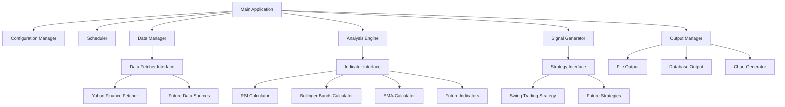

# Design Document

## Overview

The Stock Trading Bot is designed as a modular, cross-platform application that combines real-time data ingestion, technical analysis, and automated signal generation. The system follows a plugin-based architecture to support extensibility while maintaining clear separation of concerns. The application will be packaged as a single executable using PyInstaller for easy deployment across Windows, Mac, and Linux platforms.

## Architecture

### High-Level Architecture



### Core Components

1. **Main Application**: Entry point that orchestrates all components and handles CLI arguments
2. **Configuration Manager**: Loads and validates YAML configuration, provides runtime settings
3. **Scheduler**: Manages automated execution cycles and manual triggers
4. **Data Manager**: Coordinates data fetching, storage, and retrieval operations
5. **Analysis Engine**: Calculates technical indicators using modular calculator components
6. **Signal Generator**: Applies trading strategies to generate buy/sell signals
7. **Output Manager**: Handles all output operations including files, database, and charts

## Components and Interfaces

### Data Fetcher Interface

```python
class DataFetcherInterface:
    def fetch_current_data(self, symbols: List[str]) -> Dict[str, OHLCV]
    def fetch_historical_data(self, symbol: str, period: str) -> DataFrame
    def validate_symbol(self, symbol: str) -> bool
    def get_supported_exchanges(self) -> List[str]
```

**Yahoo Finance Implementation:**
- Uses yfinance library for data retrieval
- Implements rate limiting and error handling
- Supports both real-time and historical data fetching
- Handles API failures gracefully with retry logic

### Technical Indicator Interface

```python
class IndicatorInterface:
    def calculate(self, data: DataFrame, params: Dict) -> Series
    def get_required_periods(self, params: Dict) -> int
    def validate_params(self, params: Dict) -> bool
    def get_default_params(self) -> Dict
```

**Indicator Implementations:**
- **RSI Calculator**: Uses ta library, configurable period (default 14)
- **Bollinger Bands Calculator**: Configurable period and standard deviation multiplier
- **EMA Calculator**: Exponential moving average with configurable period
- All indicators handle insufficient data scenarios gracefully

### Strategy Interface

```python
class StrategyInterface:
    def generate_signal(self, data: DataFrame, indicators: Dict) -> Signal
    def validate_conditions(self, conditions: Dict) -> bool
    def get_required_indicators(self) -> List[str]
    def get_strategy_params(self) -> Dict
```

**Swing Trading Strategy Implementation:**
- Implements the three-condition logic (RSI, Bollinger Bands, EMA)
- Configurable thresholds for all conditions
- Returns structured Signal objects with confidence levels
- Supports backtesting mode for historical analysis

## Data Models

### Core Data Structures

```python
@dataclass
class OHLCV:
    symbol: str
    timestamp: datetime
    open: float
    high: float
    low: float
    close: float
    volume: int

@dataclass
class Signal:
    symbol: str
    timestamp: datetime
    signal_type: SignalType  # BUY, SELL, NO_SIGNAL
    confidence: float
    indicators: Dict[str, float]
    strategy_name: str

@dataclass
class IndicatorValue:
    symbol: str
    timestamp: datetime
    indicator_name: str
    value: float
    parameters: Dict
```

### Database Schema

**SQLite Tables:**
- `price_data`: Stores OHLCV data with indexes on symbol and timestamp
- `indicators`: Stores calculated indicator values with metadata
- `signals`: Stores generated signals with full context
- `system_log`: Stores application events and errors

### Configuration Schema

```yaml
# config.yaml structure
data_sources:
  yahoo_finance:
    enabled: true
    rate_limit: 5  # requests per second
    
watchlist:
  - "AAPL"
  - "GOOGL"
  - "MSFT"

indicators:
  rsi:
    period: 14
  bollinger_bands:
    period: 20
    std_dev: 2
  ema:
    period: 20

strategy:
  swing_trading:
    rsi_oversold: 30
    rsi_overbought: 70
    
scheduling:
  update_interval: 300  # seconds
  market_hours_only: true

output:
  csv_file: "signals.csv"
  database: "trading_data.db"
  charts_enabled: false
```

## Error Handling

### Error Categories and Responses

1. **Data Fetching Errors**:
   - Network timeouts: Retry with exponential backoff
   - Invalid symbols: Log warning and skip symbol
   - API rate limits: Implement request throttling
   - Service unavailable: Continue with cached data if available

2. **Calculation Errors**:
   - Insufficient data: Skip signal generation, log warning
   - Invalid parameters: Use defaults, log configuration error
   - Numerical errors: Handle division by zero, infinite values

3. **System Errors**:
   - File I/O errors: Create directories, handle permissions
   - Database errors: Implement connection pooling, retry logic
   - Configuration errors: Validate on startup, use safe defaults

### Logging Strategy

- Structured logging using Python's logging module
- Log levels: DEBUG, INFO, WARNING, ERROR, CRITICAL
- Separate log files for different components
- Configurable log rotation and retention
- Performance metrics logging for optimization

## Testing Strategy

### Unit Testing

- **Data Fetchers**: Mock API responses, test error conditions
- **Indicators**: Test with known datasets, validate mathematical accuracy
- **Strategies**: Test signal generation with various market conditions
- **Configuration**: Test validation and default handling

### Integration Testing

- **End-to-End Workflows**: Test complete data fetch → analysis → signal generation
- **Database Operations**: Test data persistence and retrieval
- **Scheduler Integration**: Test automated execution cycles
- **Cross-Platform**: Test executable generation and execution

### Performance Testing

- **Memory Usage**: Ensure operation within 2GB limit
- **Processing Speed**: Benchmark indicator calculations
- **Concurrent Operations**: Test multiple symbol processing
- **Long-Running Stability**: Test 24/7 operation scenarios

### Validation Testing

- **Historical Backtesting**: Validate signals against known market data
- **Configuration Validation**: Test various parameter combinations
- **Error Recovery**: Test system behavior under failure conditions
- **Data Integrity**: Verify calculation accuracy and data consistency

## Deployment and Packaging

### PyInstaller Configuration

- Single-file executable generation for each platform
- Include all required dependencies (pandas, numpy, ta, yfinance)
- Optimize for size while maintaining functionality
- Handle platform-specific library requirements

### Cross-Platform Considerations

- File path handling using pathlib
- Database file location handling
- Configuration file discovery
- Process management for scheduling
- Signal handling for graceful shutdown

### Resource Optimization

- Lazy loading of large libraries
- Efficient data structures for time series
- Memory-mapped database access
- Configurable data retention policies
- Optional features to reduce resource usage