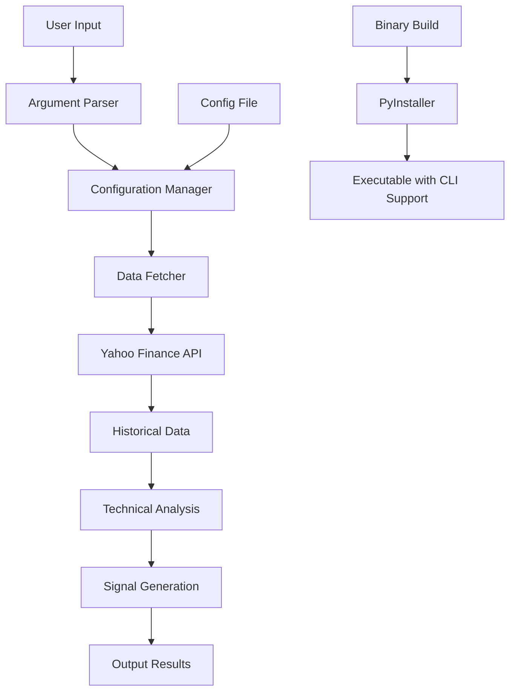

# Design Document

## Overview

This design enhances the NIFTY trading bot to fetch maximum historical data from stock inception and fixes command line argument handling in binary builds. The solution involves modifying data fetching logic to prioritize "max" period and updating the PyInstaller configuration to properly handle command line arguments.

## Architecture

The enhancement affects three main components:

1. **Data Fetching Layer**: Modified to attempt maximum historical data retrieval
2. **Configuration Management**: Enhanced to support configurable data period limits
3. **Binary Build Process**: Updated to ensure proper command line argument handling



## Components and Interfaces

### Enhanced Data Fetcher

**Location**: `enhanced_nifty_trading_bot.py`, `src/data/yahoo_finance_fetcher.py`

**Changes**:
- Modify `analyze_symbol_enhanced()` function to use "max" as first priority
- Update period fallback sequence: `["max", "10y", "5y", "2y", "1y", "6mo"]`
- Add configuration support for `max_data_period` setting
- Enhance logging to show actual data range obtained

**Interface**:
```python
def analyze_symbol_enhanced(symbol, logger, max_data_years=None, config=None):
    """
    Analyze symbol with enhanced historical data fetching.
    
    Args:
        symbol: Stock symbol to analyze
        logger: Logger instance
        max_data_years: Optional limit (None for maximum available)
        config: Configuration object with data fetching settings
    """
```

### Configuration Enhancement

**Location**: `config_enhanced_nifty.yaml`, `config_nifty50.yaml`, `config_nifty500.yaml`

**New Configuration Section**:
```yaml
# Data fetching configuration
data_fetching:
  max_data_period: "max"  # "max" for inception, or specific period like "10y"
  fallback_periods: ["max", "10y", "5y", "2y", "1y", "6mo"]
  min_data_threshold: 200  # Minimum days of data required
  timeout_per_symbol: 60   # Timeout for data fetching
```

### Binary Build Enhancement

**Location**: `build_nifty_binary.py`

**Changes**:
- Update PyInstaller spec to ensure argparse module is included
- Add console=True to maintain command line interface
- Include all configuration files in binary
- Test command line argument parsing in build process

**Updated Spec Configuration**:
```python
exe = EXE(
    pyz,
    a.scripts,
    a.binaries,
    a.zipfiles,
    a.datas,
    [],
    name='nifty-trading-bot',
    debug=False,
    bootloader_ignore_signals=False,
    strip=False,
    upx=True,
    console=True,  # Ensure console mode for CLI args
    disable_windowed_traceback=False,
    argv_emulation=False,  # Proper argument handling
    target_arch=None,
)
```

## Data Models

### Enhanced Stock Analysis Result

```python
{
    'symbol': str,
    'timestamp': datetime,
    'signal': str,
    'signal_score': int,
    'price': float,
    
    # Enhanced data information
    'data_start_date': str,      # Actual start date of data
    'data_end_date': str,        # Actual end date of data
    'data_years': float,         # Actual years of data
    'data_records': int,         # Number of data points
    'data_period_used': str,     # Period that successfully fetched data
    
    # Existing technical indicators...
    'rsi_14': float,
    'rsi_21': float,
    'rsi_50': float,
    # ... other indicators
}
```

### Configuration Schema

```python
class DataFetchingConfig:
    max_data_period: str = "max"
    fallback_periods: List[str] = ["max", "10y", "5y", "2y", "1y", "6mo"]
    min_data_threshold: int = 200
    timeout_per_symbol: int = 60
    show_data_summary: bool = True
```

## Error Handling

### Data Fetching Errors

1. **Network Timeouts**: Retry with shorter periods, log warnings
2. **Invalid Symbols**: Skip symbol, log error, continue processing
3. **Insufficient Data**: Warn user, attempt analysis if minimum threshold met
4. **API Rate Limits**: Implement exponential backoff, respect rate limits

### Binary Argument Errors

1. **Invalid Arguments**: Display help message and exit gracefully
2. **Missing Dependencies**: Show clear error message about requirements
3. **Configuration Errors**: Validate config files, use defaults if needed

## Testing Strategy

### Unit Tests

1. **Data Fetching Tests**:
   - Test period fallback logic
   - Test configuration loading
   - Test data validation
   - Mock Yahoo Finance API responses

2. **Argument Parsing Tests**:
   - Test all command line combinations
   - Test error handling for invalid arguments
   - Test default value assignment

### Integration Tests

1. **End-to-End Data Fetching**:
   - Test with real symbols using different periods
   - Verify data quality and completeness
   - Test timeout handling

2. **Binary Functionality Tests**:
   - Test binary with various argument combinations
   - Verify output file generation
   - Test configuration file loading

### Performance Tests

1. **Large Dataset Handling**:
   - Test with NIFTY 500 using "max" period
   - Monitor memory usage and processing time
   - Test timeout and cancellation handling

## Implementation Considerations

### Backward Compatibility

- Existing configuration files will continue to work
- Default behavior changes to fetch maximum data
- Command line interface remains the same

### Performance Impact

- Fetching "max" data may increase processing time
- Implement progress indicators for user feedback
- Add option to limit data period for faster analysis

### Data Storage

- Consider caching historical data to reduce API calls
- Implement data freshness checks
- Store metadata about data ranges for future reference

## Security Considerations

- Validate all user inputs and configuration values
- Implement proper error handling to prevent information disclosure
- Ensure binary doesn't expose sensitive configuration in error messages